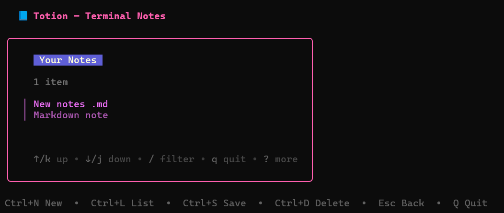

# Totion

Totion is a terminal-based note-taking application built using Go and the Charmbracelet Bubble Tea ecosystem.  
It allows users to create, edit, list, and save notes directly from the terminal using a keyboard-driven interface.

---

## Features

- Create new notes
- Edit existing notes
- List saved notes
- Save notes locally
- Terminal-based UI using Bubble Tea and Lipgloss

---

## Screenshot

Prototype screenshot of Totion running in the terminal:




---

## Tech Stack

- Go (Golang)
- Bubble Tea
- Bubbles (textinput, textarea, list)
- Lipgloss

---

## Installation

Clone the repository:

```bash
git clone https://github.com/AbhayDutta/Totion.git
cd Totion
